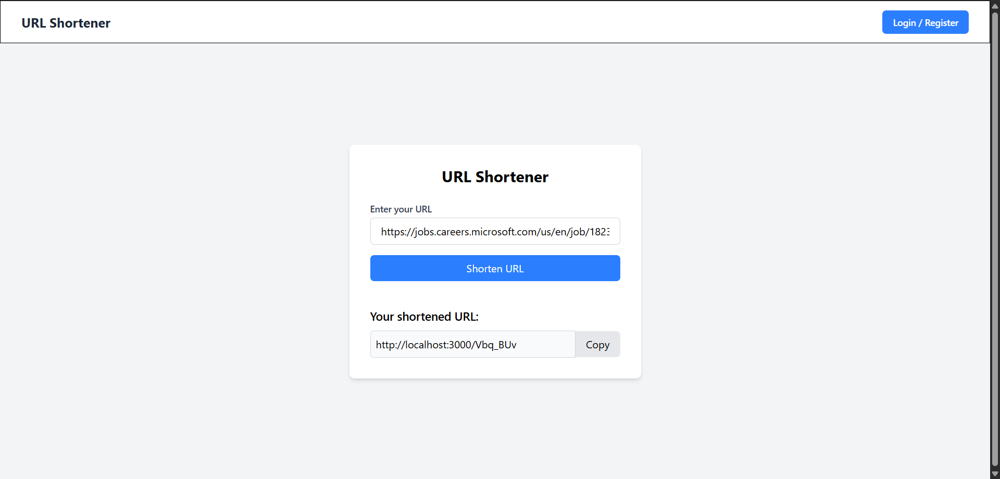
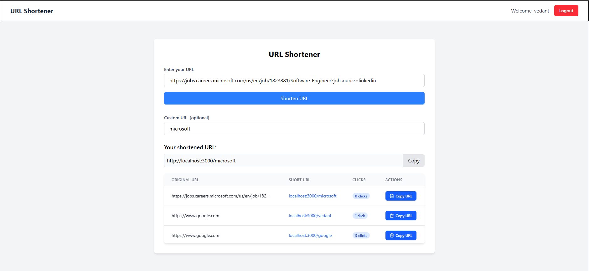

# URL Shortener

A full-stack web application for shortening URLs with user authentication, dashboard, and analytics. Users can create short links, track clicks, and manage their URLs. Authenticated users can create custom short URLs and view their personal dashboard.

## Features
- Shorten long URLs instantly (with or without login)
- User registration and login (JWT-based authentication)
- Dashboard to view, copy, and track your shortened URLs
- Click analytics for each short URL
- Custom short URLs for authenticated users
- Responsive, modern UI with Tailwind CSS

## Technologies Used

### Frontend
- **React**: UI library for building interactive interfaces
- **Redux**: State management for authentication and user data
- **@tanstack/react-query**: Data fetching and caching
- **Tailwind CSS**: Utility-first CSS framework for styling
- **Axios**: HTTP client for API requests

### Backend
- **Node.js**: JavaScript runtime
- **Express**: Web framework for building REST APIs
- **MongoDB**: NoSQL database for storing users and URLs
- **Mongoose**: ODM for MongoDB
- **JWT (jsonwebtoken)**: Secure authentication
- **bcrypt/bcryptjs**: Password hashing

## Screenshots

### Landing Page


### Dashboard Page


## Quick Start

### Prerequisites
- Node.js (v16+ recommended)
- MongoDB instance (local or cloud)

### Backend
```bash
cd backend
npm install
npm run dev
```

### Frontend
```bash
cd frontend
npm install
npm run dev
```

### Environment Variables
- **Backend**: Create a `.env` file in `backend/` with:
  - `MONGO_URI=your_mongodb_connection_string`
  - `JWT_SECRET=your_jwt_secret`
  - `APP_URL=http://localhost:5000` (or your backend URL)
- **Frontend**: Update `VITE_API_URL` in `frontend/.env` if needed.

---

Enjoy your own URL Shortener! Contributions welcome. 